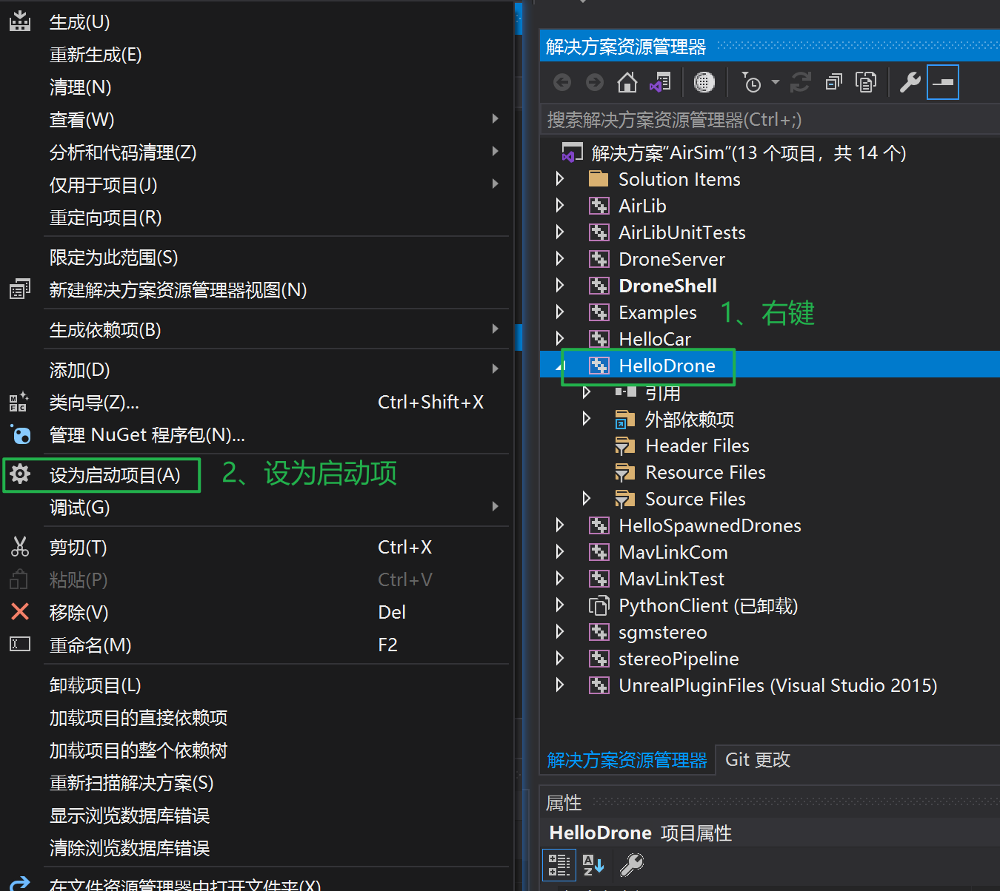
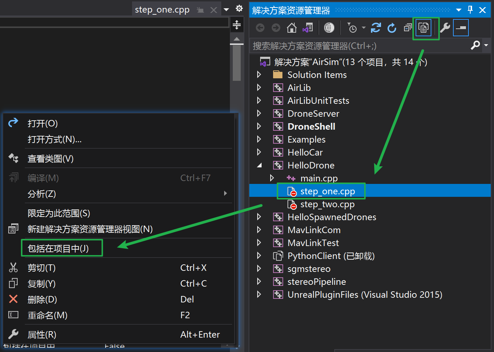
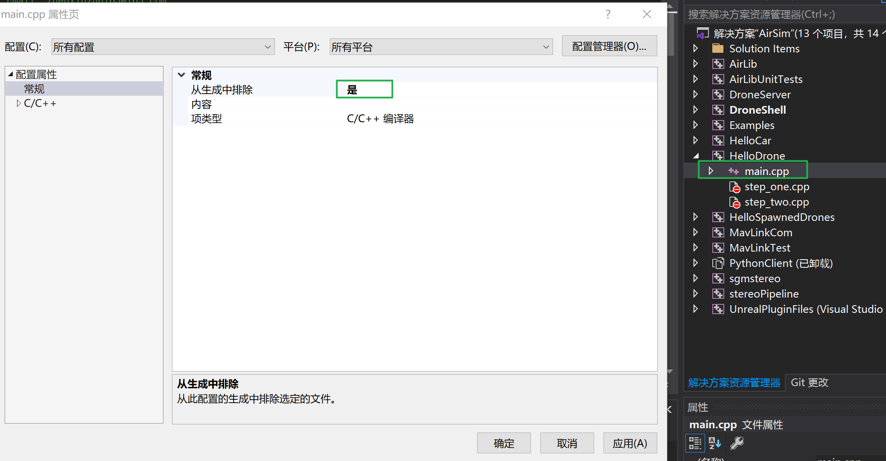
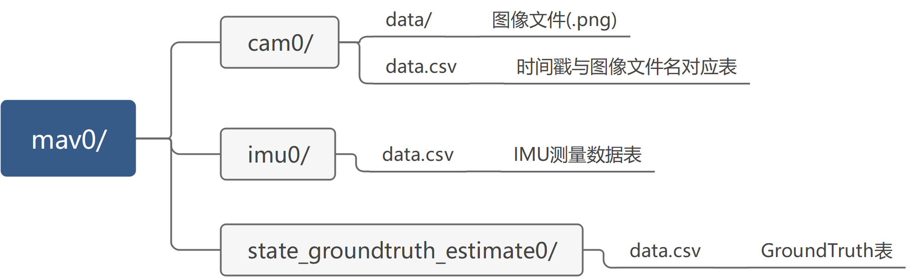

# AirSim-Dataset-Gain

#### 介绍
本项目为参考[VIODE](https://github.com/kminoda/VIODE)数据集的采集方法进行的复现，可以实现采集高频率、高质量的IMU和图像数据。

VIODE 数据集介绍:  
[](https://youtu.be/LlFTyQf_dlo "VIODE")

**本项目介绍**


#### 系统架构


#### 运行环境

本项目基于AirSim、UE4等环境，具体版本：

* AirSim：1.6.0
* UE4：4.25(无关紧要)
* 操作系统：windows10
* IDE：Visual Studio2019([可以正常编译AirSim](https://microsoft.github.io/AirSim/build_windows/))


#### 安装教程

##### Prerequests

1. 完成AirSim的在Win下的安装，[参考](https://microsoft.github.io/AirSim/build_windows/)。

2. 下载本项目：

   ```bash
   git clone https://github.com/jike5/AirSim-VIO-Dataset-Gain.git
   ```

#### 使用说明

1. 将本项目文件添加到`AirSim`项目中

   为了避免配置`Visual Studio`项目，非常建议采用以下方法：

   * 打开`AirSim`项目文件夹，进入`HelloDrone`文件夹下

   * 复制本项目的`*.cpp`到`HelloDrone`目录

   

2. 使用Visual Studio2019打开AirSim项目

      双击`AirSim/AirSim.sln`打开VS

      设置启动项：

      

      包含`step_one.cpp`和`step_two.cpp`

      

      右键`main.cpp`-->`属性`-->从生成排除：是

      

      用同样的方法将`step_one.cpp`设置为：`从生成排除：否`；将`step_two.cpp`设置为：`从生成排除：是`

      这样`F5`就会启动`HelloDrone`项目下的`step_one.cpp`的`main`函数了，后面切换第二步时只需用把`step_one.cpp`从生成排除，把`step_two.cpp`包含即可。在启动该程序前还需要配置一下硬件在环控制。

3. 设置`settings.json`

      本项目中`json/`目录下提供了硬件在环的json文件：`px4.json`

      **如果您不想使用硬件在环的方式控制无人机，您也可以使用[API](https://microsoft.github.io/AirSim/apis/#apis-for-multirotor)或者只使用[遥控器](https://microsoft.github.io/AirSim/remote_control/#rc-setup-for-default-config)。如果你不是使用硬件在环的方式，只需按照参考链接完成配置，可跳过本条。**

      **本项目中采用硬件在环的原因：**

      * 暂无合适的遥控器；AirSim官方适配的为[FrSky Taranis X9D Plus](https://hobbyking.com/en_us/frsky-2-4ghz-accst-taranis-x9d-plus-and-x8r-combo-digital-telemetry-radio-system-mode-2.html)，而本人手里只有 *富斯i6* 和 *乐迪AT9S Pro* 这两款，经过测试这两款均达不到FrSky Taranis X9D Plus的效果。
      * 另一种使用API的方式编写控制代码较为复杂，如果要实现简单的轨迹如圆、方形工作量还可以接受。另一方面，由于本项目采集数据服务于SLAM，视觉初始化需要一个好的初始化动作，直接使用航模遥控比API控制个人觉得可能更为便捷。

      **[硬件在环设置步骤](https://microsoft.github.io/AirSim/px4_setup/)：**

      * 连接PX4的 USB口与电脑
      * 打开QGC，如果能正常显示连接说明连接成功
      * 保证遥控器与接收机正常连接，可以在QGC里遥控器校准里查看
      * 将`json/px4.json`里的内容复制到你的AirSim配置文件，一般在`C:\Users\youname\Documents\AirSim`下名为`settings.json`的文件
      * 打开一个编译好的AirSim环境(如Blocks)，可以通过遥控器解锁进行起飞、控制表明配置成功

      （以上叙述较为简略，建议没有用过飞控的参考[AirSim官方](https://microsoft.github.io/AirSim/px4_setup/)和[PX4](https://docs.px4.io/master/en/)，或者考虑前面提到的使用**API**或者**遥控器直接连接**）

4. 启动IMU&GT采集程序

      回到Visual Studio2019，`F5`启动程序，默认数据会保存在`D:\\AirSim\\dataset`下，文件夹名为当前日期和时间，格式与[EuRoc](https://projects.asl.ethz.ch/datasets/doku.php?id=kmavvisualinertialdatasets#the_euroc_mav_dataset)数据集保持一致

      

      

   

#### 参与贡献

1.  Fork 本仓库
2.  新建 Feat_xxx 分支
3.  提交代码
4.  新建 Pull Request

#### TODO

